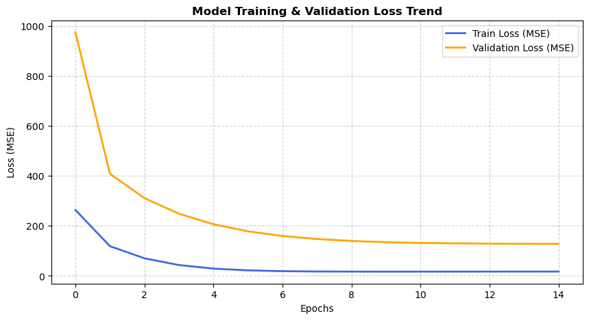
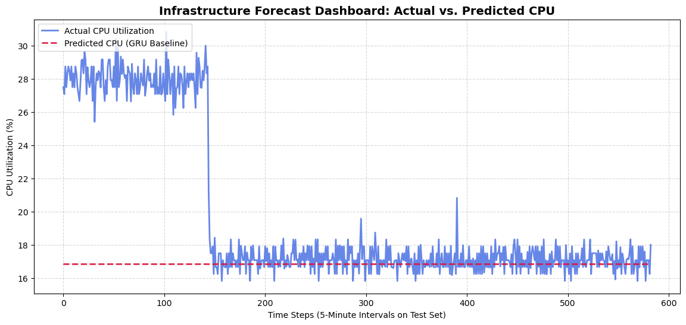

# InfraInsight: Predictive System Analytics with PyTorch

[](https://www.python.org/)
[](https://pytorch.org/)
[](https://github.com/psf/black)
[](https://github.com/astral-sh/ruff)
[](https://github.com/)

An end-to-end Machine Learning engineering pipeline designed to forecast infrastructure resource utilization (e.g., CPU, RAM, Network I/O). By leveraging deep sequential models, this framework aims to proactively detect potential system bottlenecks or over-provisioning before they affect production environments.

This repository serves as a professional software showcase demonstrating strict production-grade engineering principles applied to Data Science: centralized hyperparameter management, automated logging, plattform-independent path resolution, and an isolated, fully non-leaking evaluation layer.

---

## 📖 Deep Technical Documentation & Architecture

Instead of cluttering the root file with extensive mathematical breakdowns and statistical proofs, the complete engineering background is fully documented in the **[InfraInsight GitHub Wiki](https://github.com/)** *(Insert your repository wiki link here)*.

### 🗺️ Wiki Quick Links:
* **[Architecture Overview](https://github.com/)** – Package segmentation, code interfaces, and system runtime workflow.
* **[Data Pipeline & Feature Engineering](https://github.com/)** – Autocorrelation bounds, rolling context features, and cyclic time representation.
* **[Model Mechanics & Optimization](https://github.com/)** – Gated Recurrent Unit (GRU) dimensions, Apple Silicon acceleration (MPS), and loss dynamics.
* **[Validation Strategy](https://github.com/)** – Chronological multi-splitting and the mathematical prevention of Data Leakage.

---

## 📊 Baseline Performance Dashboard

The pipeline automatically monitors convergence and evaluates model checkpoints out-of-time against completely unseen test data.

### 1. Training Convergence Trend
The optimization phase shows clear exponential decay and high numerical stability across both training and validation sets:



### 2. Forecast Performance vs. Reality
Headless evaluation on the out-of-time Test Set confirms that the GRU baseline effectively locks onto the localized system baseline noise:



### 🏆 Evaluated Baseline Metrics:
* **Mean Absolute Error (MAE):** `3.19% CPU`
* **Root Mean Squared Error (RMSE):** `5.61% CPU`

---

## 🚀 Getting Started

### Prerequisites
Ensure that **Miniforge** or **Anaconda** is installed on your local machine.

### Environment Deployment
Clone the repository and reproduce the exact, locked development environment using Conda:

```bash
# Clone the repository
git clone [https://github.com/your-username/infra-insight.git](https://github.com/your-username/infra-insight.git)
cd infra-insight

# Create the environment from the locked specification
conda env create -f environment.yml

# Activate the project environment
conda activate infra-insight
```

# 🚀 Running the Pipeline

You can execute the entire workflow—from exploratory analysis to final model evaluation—either interactively through the provided Jupyter Notebooks or directly from the command line using the headless training components.

## Step 1: Data Processing & Feature Engineering

Preprocess the raw telemetry data, generate temporal features, perform dataset splitting, and persist all intermediate artifacts.

```bash
python -c "from src.config import Config; from src.data import process_and_split_data; process_and_split_data(Config())"
```

This step:

- Loads the raw telemetry dataset.
- Applies feature engineering and temporal transformations.
- Generates Train, Validation, and Test splits.
- Persists scaled datasets (`.npz`) and scaler objects (`.pkl`) for downstream training.

## Step 2: Model Training

Launch the training pipeline and automatically generate model checkpoints.

```bash
python src/training/train.py
```

This step:

- Loads the preprocessed datasets.
- Instantiates the configured neural architecture.
- Executes the training and validation loops.
- Tracks loss convergence and model performance.
- Saves the best-performing checkpoint based on validation loss.

# 🔮 Future Roadmap

The platform is intentionally designed for long-term scalability and enterprise-grade extensibility.

## 🔄 Multivariate Extension

Integrate additional infrastructure signals such as:

- Network I/O
- Disk Read/Write Throughput
- Memory Utilization
- Process-Level Metrics

These auxiliary features can be incorporated into the recurrent hidden state, enabling the model to capture complex non-linear system dynamics and abrupt level shifts that are impossible to infer from CPU utilization alone.

## ⚡ PySpark Migration

Migrate the feature-engineering and preprocessing layer to **Apache Spark** to support industrial-scale telemetry workloads.

Benefits include:

- Distributed feature generation
- Parallelized preprocessing
- Improved scalability for multi-server environments
- Reduced processing times for large historical datasets

## 🏛️ Data Vault 2.0 Integration

Implement a structured **Data Vault 2.0** architecture as the long-term storage backbone for telemetry data.

Key objectives include:

- Auditable historical tracking
- Separation of business keys and descriptive attributes
- Incremental data loading
- Improved lineage and governance
- Enterprise-ready support for multi-server telemetry ecosystems

This architectural evolution establishes the foundation for large-scale predictive infrastructure monitoring, continuous model retraining, and future MLOps integration.
